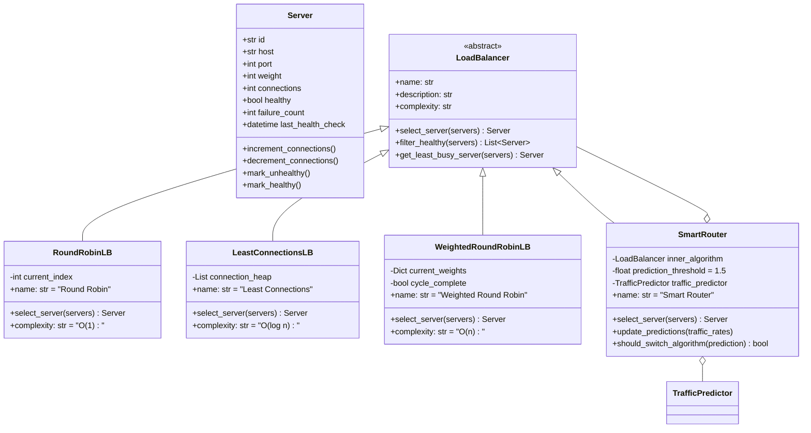
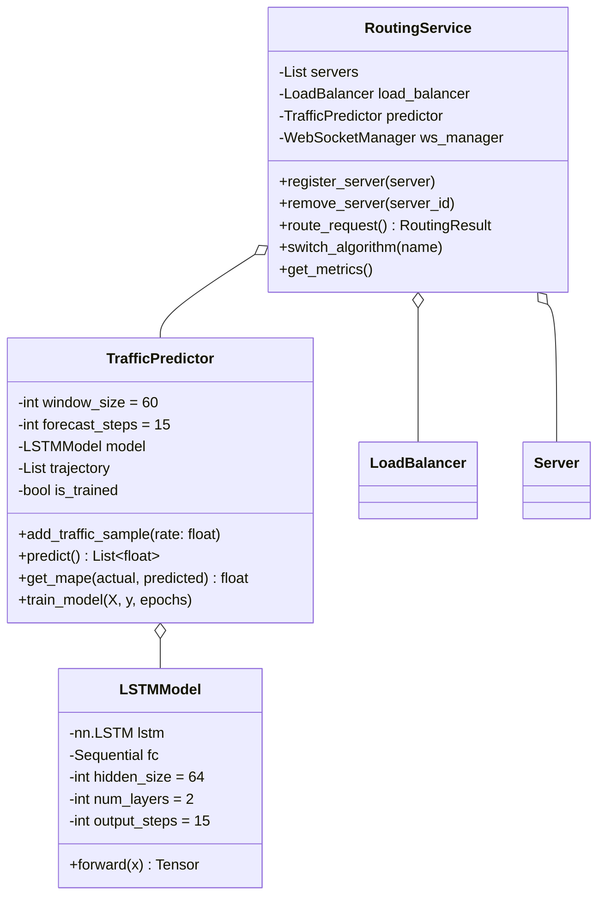
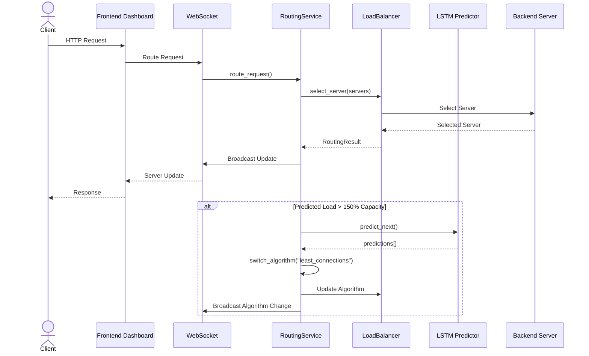
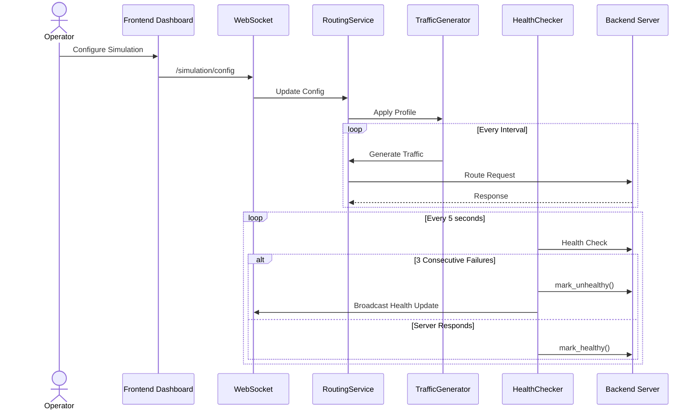
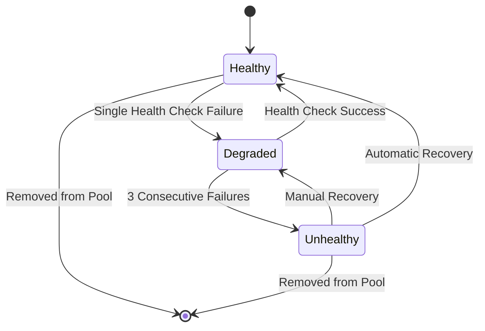
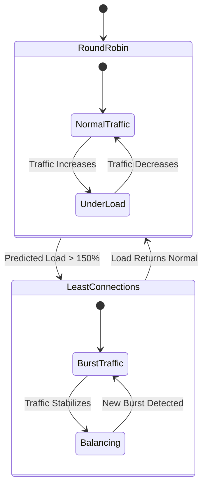
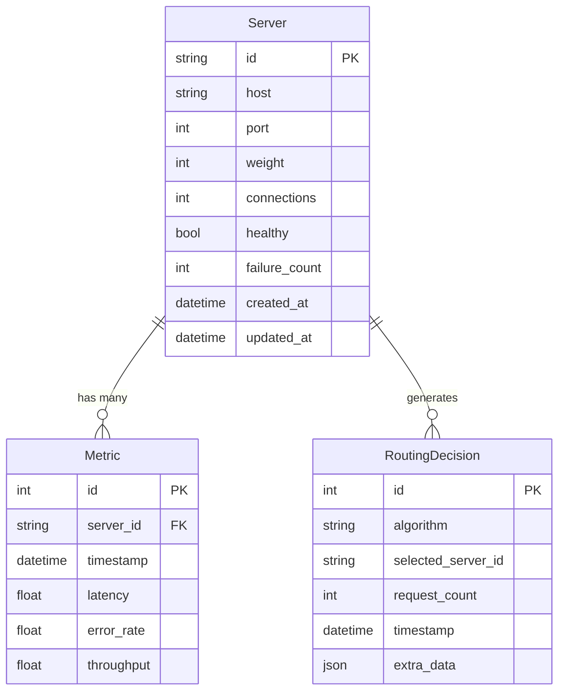
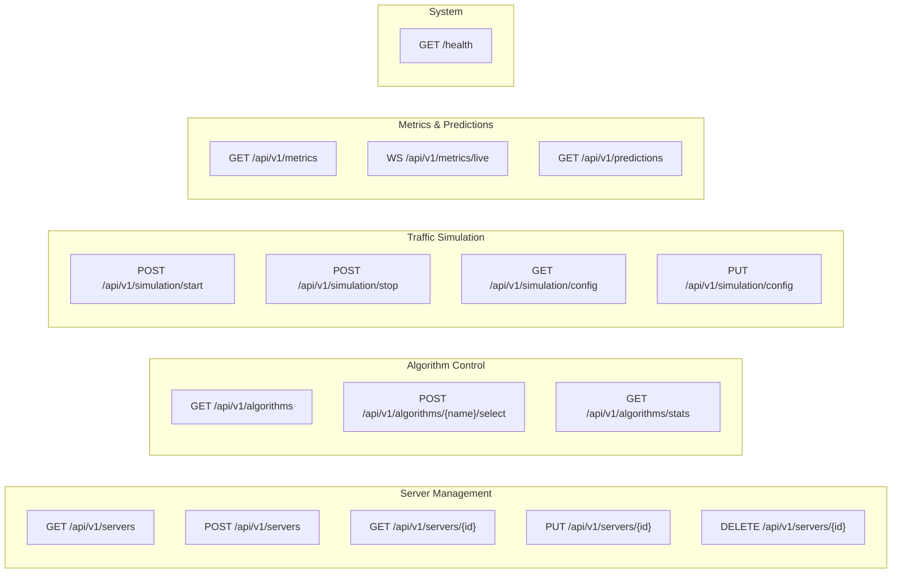

# SmartBalance - UML Documentation

This document contains UML diagrams for the SmartBalance AI-driven load balancer system.

## System Architecture Overview

```mermaid
graph TB
    subgraph Frontend["Frontend (React/Vite)"]
        Dashboard["Dashboard.tsx"]
        ServerList["ServerList.tsx"]
        MetricsChart["MetricsChart.tsx"]
        TrafficSimulator["TrafficSimulator.tsx"]
        WebSocketHook["useWebSocket.ts"]
        MetricsHook["useMetrics.ts"]
    end

    subgraph Backend["Backend (FastAPI/Python)"]
        subgraph Core["Core - Load Balancing"]
            LB_Abstract["LoadBalancer (abstract)"]
            RR_LB["RoundRobinLB"]
            LC_LB["LeastConnectionsLB"]
            WRR_LB["WeightedRoundRobinLB"]
            Smart_Router["SmartRouter"]
        end

        subgraph ML["ML - LSTM Prediction"]
            LSTM["LSTMModel"]
            Predictor["TrafficPredictor"]
        end

        subgraph Simulation["Simulation Engine"]
            TrafficGen["TrafficGenerator"]
            HealthCheck["HealthChecker"]
            FaultInject["FaultInjector"]
        end

        subgraph Services["Services"]
            RoutingSvc["RoutingService"]
            WSManager["WebSocketManager"]
        end

        subgraph Routers["API Routers"]
            ServersAPI["servers_router"]
            AlgosAPI["algorithms_router"]
            SimAPI["simulation_router"]
            MetricsAPI["metrics_router"]
        end

        subgraph Data["Data Layer"]
            ServerModel["Server.model"]
            MetricModel["Metric.model"]
            RoutingModel["RoutingDecision.model"]
        end
    end

    subgraph Database["Database"]
        DB[("SQLite")]
    end

    Dashboard --> WebSocketHook
    ServerList --> WebSocketHook
    MetricsChart --> MetricsHook
    TrafficSimulator --> WebSocketHook
    WebSocketHook --> WSManager
    MetricsHook --> WSManager

    LB_Abstract <|-- RR_LB
    LB_Abstract <|-- LC_LB
    LB_Abstract <|-- WRR_LB
    LB_Abstract <|-- Smart_Router

    Smart_Router --> Predictor
    Smart_Router --> LC_LB
    RoutingSvc --> LB_Abstract
    RoutingSvc --> WSManager

    TrafficGen --> RoutingSvc
    HealthCheck --> RoutingSvc

    ServersAPI --> RoutingSvc
    AlgosAPI --> RoutingSvc
    SimAPI --> TrafficGen

    ServerModel --> DB
    MetricModel --> DB
    RoutingModel --> DB
```

## Class Diagram - Core Load Balancing



## Class Diagram - ML Prediction



## Sequence Diagram - Request Routing



## Sequence Diagram - Traffic Simulation



## State Diagram - Server Health



## State Diagram - Algorithm Selection



## Data Model



## API Endpoints



## Algorithm Specifications

| Algorithm | Time Complexity | Use Case |
|-----------|-----------------|----------|
| Round Robin | O(1) | Default, even traffic distribution |
| Least Connections | O(log n) | Variable request durations |
| Weighted Round Robin | O(n) | Servers with different capacities |
| Smart Router | O(n) | AI-driven auto-switching based on LSTM predictions |

## LSTM Model Architecture

```
Input Layer: 60-step sliding window (normalized request rates)
           ↓
Hidden Layer 1: LSTM (64 units, dropout=0.2)
           ↓
Hidden Layer 2: LSTM (64 units, dropout=0.2)
           ↓
Fully Connected: Linear(64 → 32 → 15)
           ↓
Output Layer: 15-step ahead forecast
```

**Training:**
- Loss: MSE with Adam optimizer
- Target MAPE: < 15%
- Patterns: Steady, Burst, Ramp, Wave

---

*Generated from SmartBalance codebase - AI-Driven Load Balancer System*
