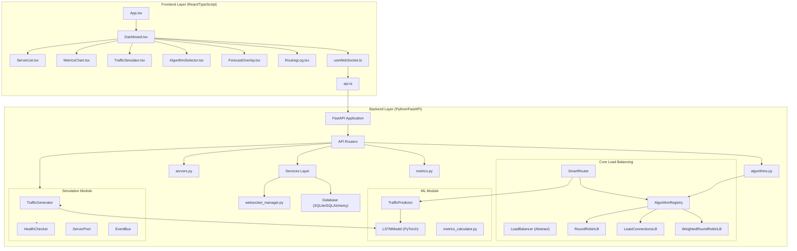

# SmartBalance System Architecture

## Component Descriptions

| Layer | Component | Description |
|-------|-----------|-------------|
| Frontend | Dashboard.tsx | Main grid container managing layout |
| Frontend | ServerList.tsx | Real-time server health cards |
| Frontend | MetricsChart.tsx | Recharts visualizations |
| Frontend | useWebSocket.ts | WebSocket connection hook |
| Backend | LoadBalancer | Abstract base class for algorithms |
| Backend | SmartRouter | AI-driven algorithm switching |
| Backend | LSTMModel | PyTorch two-layer LSTM |
| Backend | TrafficGenerator | Profile-based traffic simulation |
| Backend | HealthChecker | Background health monitoring |