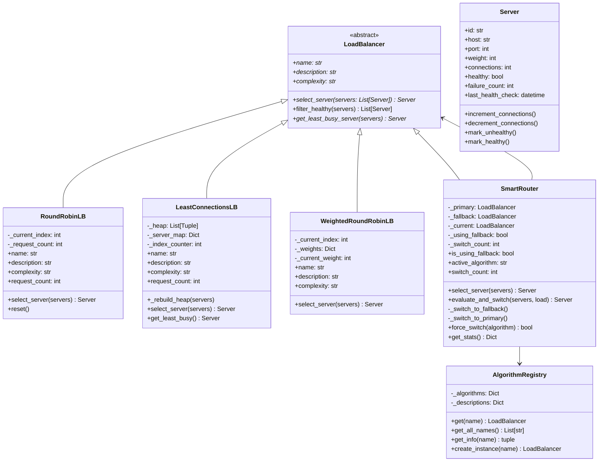
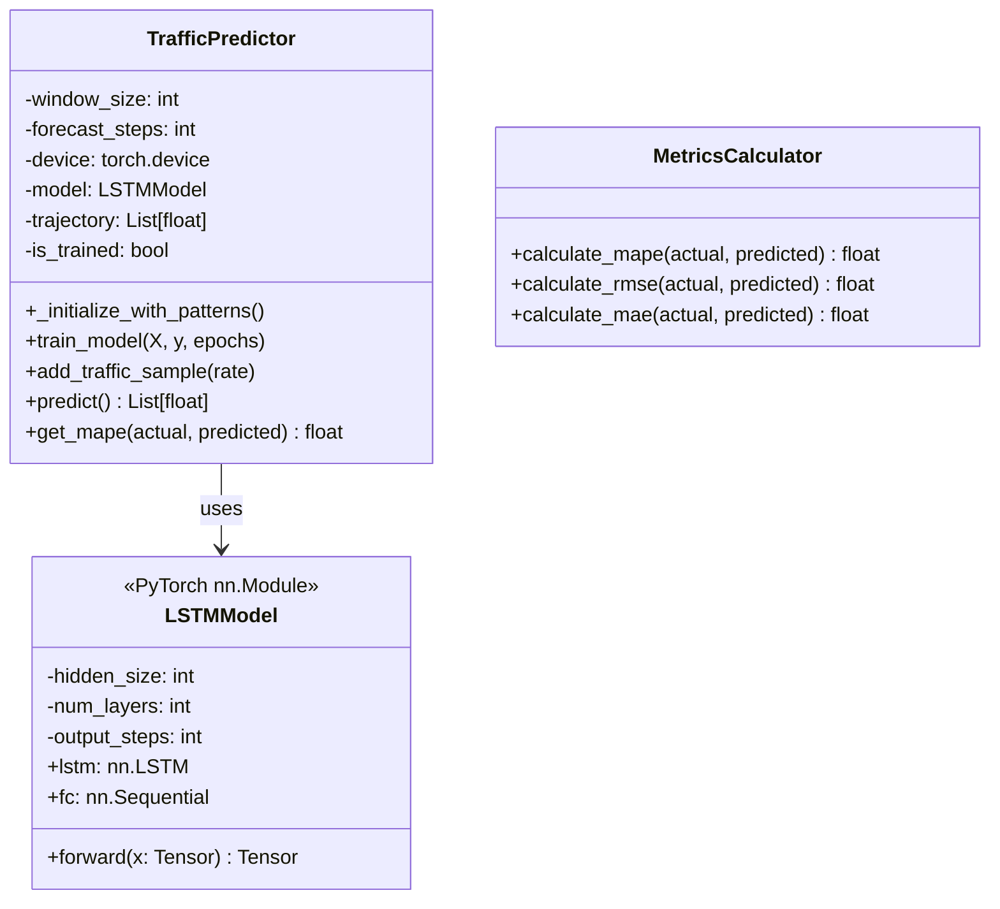
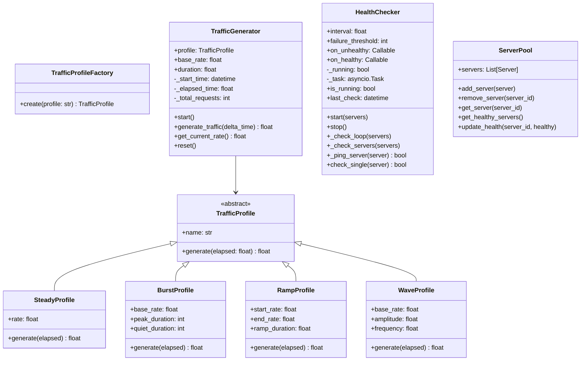
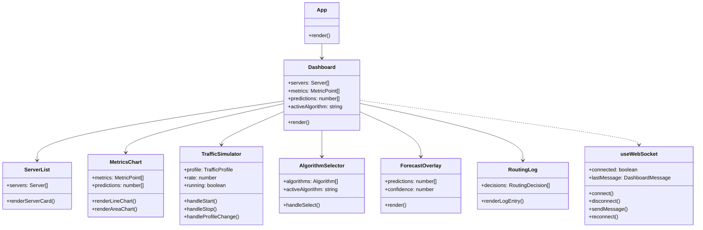

# SmartBalance Class Diagrams

## 1. Core Load Balancing Architecture



## 2. ML Module Classes



## 3. Simulation Module Classes



## 4. API Router Classes

```mermaid
classDiagram
    class FastAPI {
        +title: str
        +version: str
        +include_router(router, prefix, tags)
        +add_middleware(cors)
    }

    class ServerRouter {
        +GET / list_servers()
        +POST / create_server()
        +GET /{server_id} get_server()
        +PUT /{server_id} update_server()
        +DELETE /{server_id} delete_server()
        +PUT /{server_id}/health update_health()
    }

    class AlgorithmRouter {
        +GET / list_algorithms()
        +GET /{algorithm_name} get_algorithm()
        +POST /{algorithm_name}/select select_algorithm()
        +GET /{algorithm_name}/stats get_algorithm_stats()
    }

    class MetricsRouter {
        +GET / get_metrics()
        +GET /latest get_latest_metrics()
        +WS /live websocket_metrics()
        +broadcast_to_all(data)
    }

    class SimulationRouter {
        +GET /config get_simulation_config()
        +PUT /config update_simulation_config()
        +POST /start start_simulation()
        +POST /stop stop_simulation()
        +GET /status get_simulation_status()
        +GET /predictions get_predictions()
    }

    FastAPI --> ServerRouter
    FastAPI --> AlgorithmRouter
    FastAPI --> MetricsRouter
    FastAPI --> SimulationRouter
```

## 5. Frontend Component Classes



## 6. Data Models

```mermaid
classDiagram
    class ServerModel {
        <<SQLAlchemy ORM>>
        +id: String (PK)
        +host: String
        +port: Integer
        +weight: Integer
        +connections: Integer
        +healthy: Boolean
        +failure_count: Integer
        +created_at: DateTime
        +updated_at: DateTime
    }

    class MetricModel {
        <<SQLAlchemy ORM>>
        +id: Integer (PK)
        +server_id: String (FK)
        +timestamp: DateTime
        +latency: Float
        +connections: Integer
        +error_rate: Float
    }

    class ServerResponse {
        <<Pydantic>>
        +id: str
        +host: str
        +port: int
        +weight: int
        +connections: int
        +healthy: bool
    }

    class SimulationConfig {
        <<Pydantic>>
        +profile: str
        +rate: float
        +duration: float | None
    }

    class MetricPoint {
        <<TypeScript Interface>>
        +timestamp: string
        +latency: number
        +connections: number
        +errorRate: number
    }

    class DashboardMessage {
        <<TypeScript Interface>>
        +type: MessageType
        +timestamp: string
        +servers?: Server[]
        +metrics?: MetricPoint[]
        +predictions?: number[]
        +simulation?: SimulationState
    }

    ServerModel --> MetricModel : 1:N
```