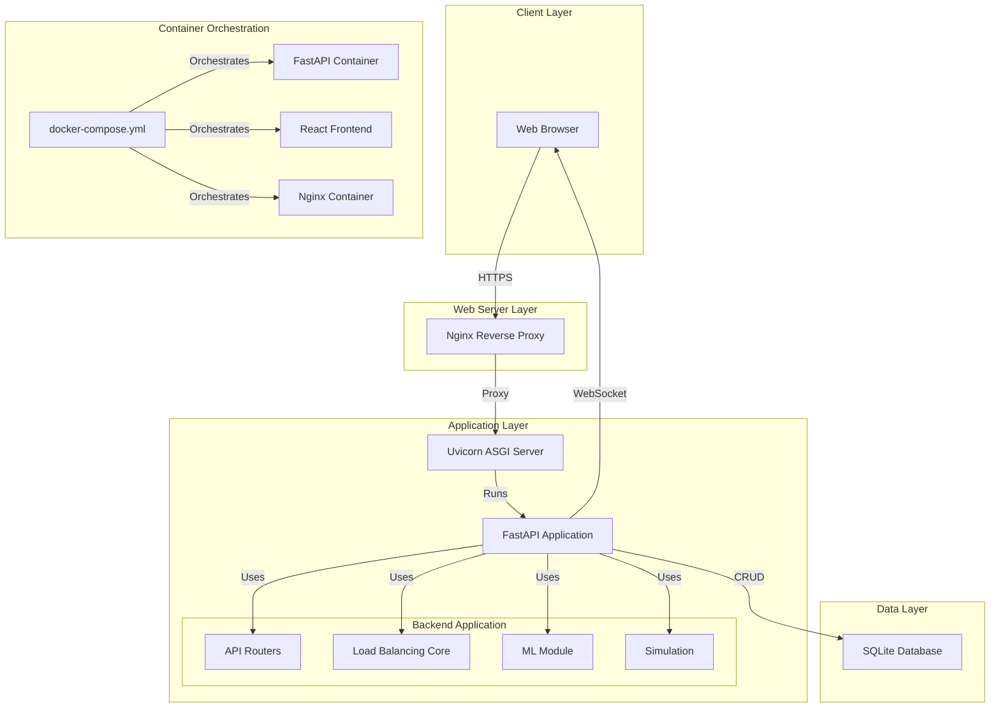

# SmartBalance Deployment Diagram

## Environment Configuration

```mermaid
graph LR
    subgraph Config["Configuration (.env)"]
        DB["DATABASE_URL"]
        HCI["HEALTH_CHECK_INTERVAL"]
        HCF["HEALTH_CHECK_FAILURE_THRESHOLD"]
        LWS["LSTM_WINDOW_SIZE"]
        LFS["LSTM_FORECAST_STEPS"]
        SRT["SMART_ROUTER_THRESHOLD"]
        MTR["MAPE_TARGET"]
    end

    subgraph Defaults["Default Values"]
        D1["5 seconds"]
        D2["3 failures"]
        D3["60 steps"]
        D4["15 steps"]
        D5["1.5x multiplier"]
        D6["15% MAPE"]
    end

    Config --> Defaults
```

## Network Ports

| Service | Port | Protocol |
|---------|------|----------|
| FastAPI | 8000 | HTTP/HTTPs |
| React Dev | 5173 | HTTP |
| React Prod | 80 | HTTP |
| Nginx | 443 | HTTPS |
| WebSocket | 8000 | WS |