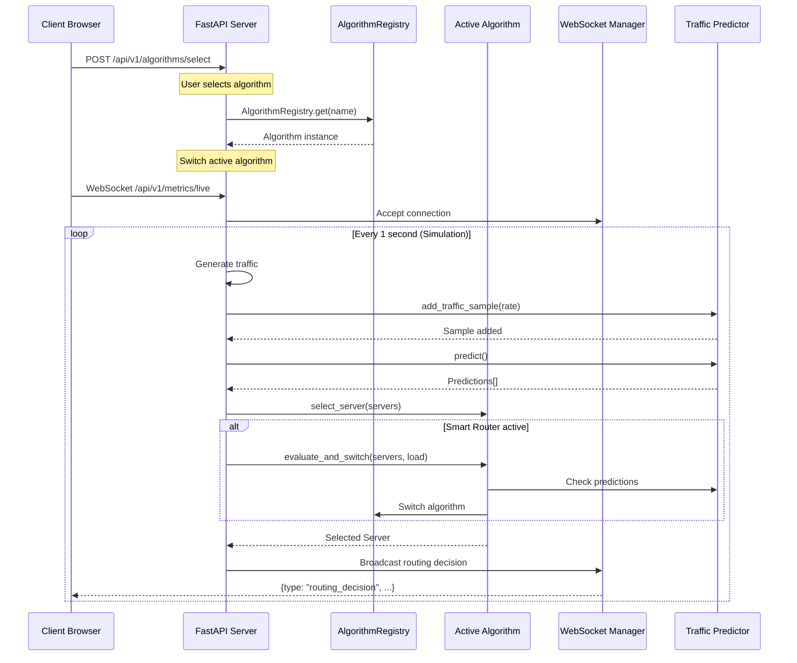
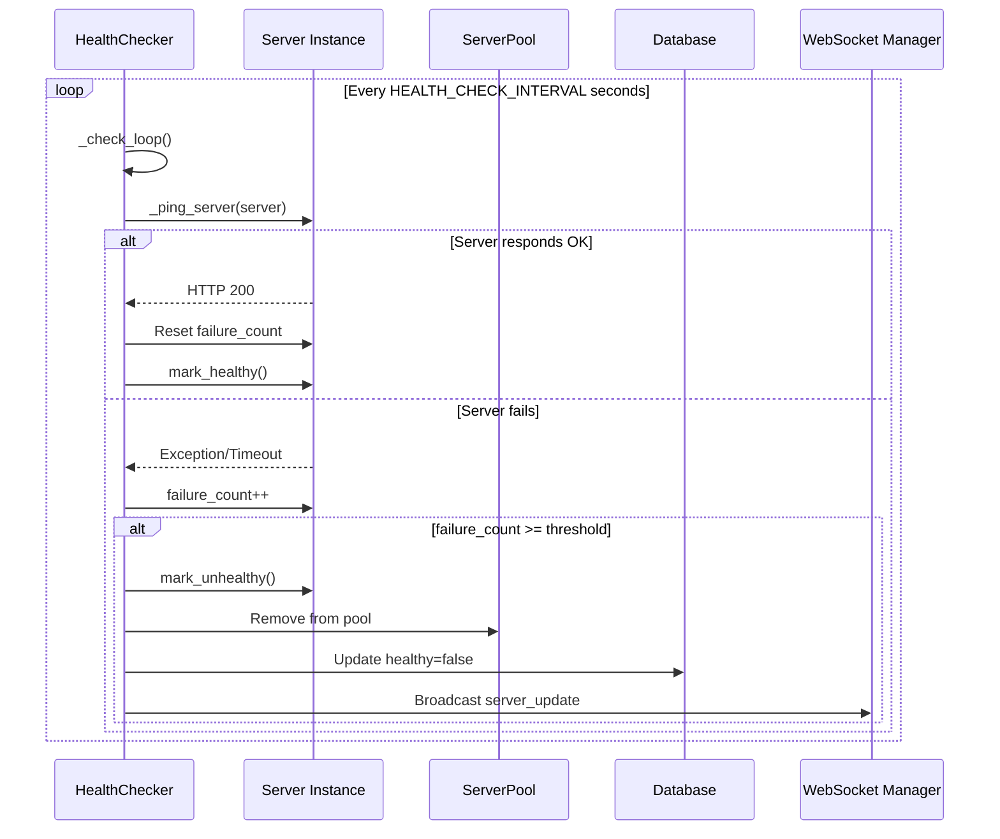
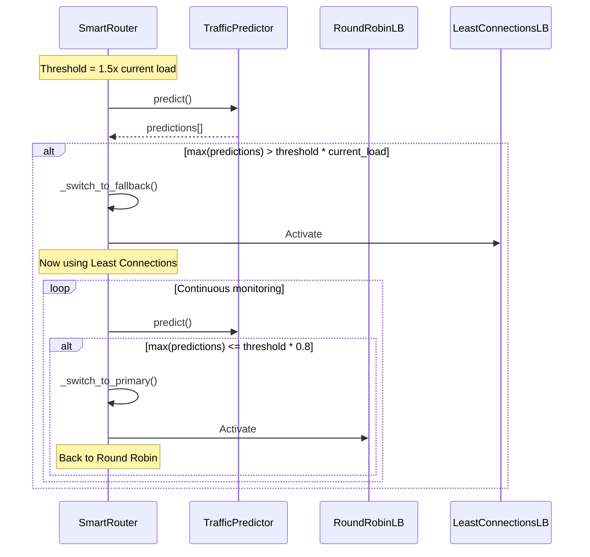
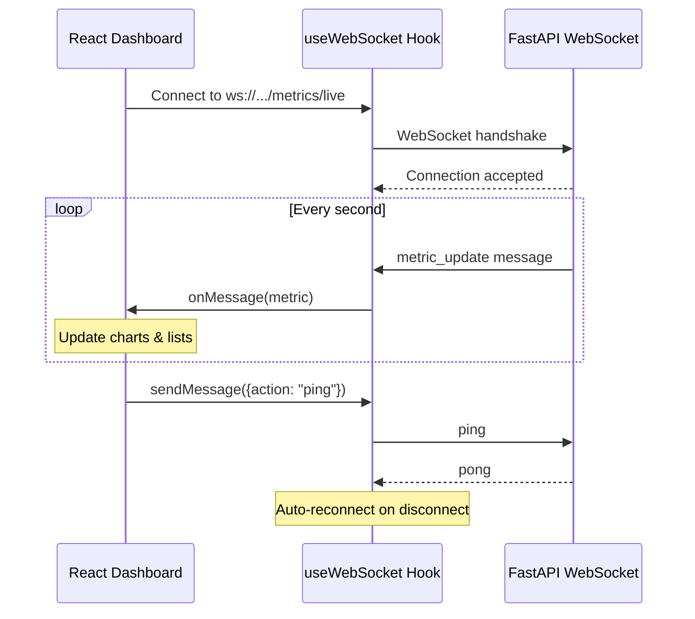
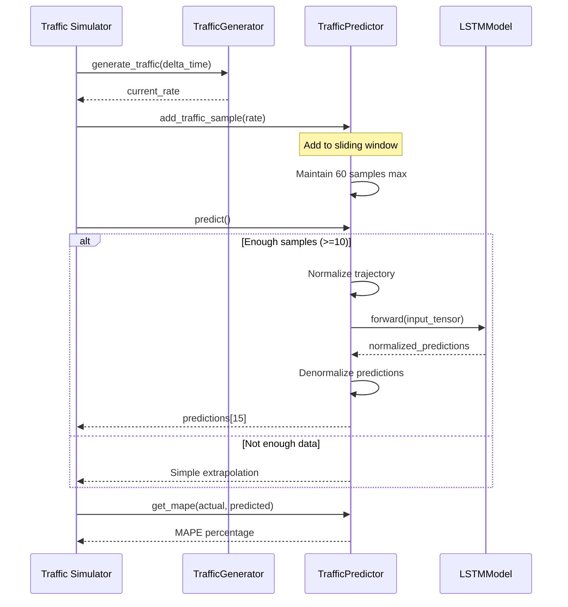

# SmartBalance Sequence Diagrams

## 1. Request Routing Sequence

## 2. Server Health Check Sequence

## 3. Algorithm Switching Sequence

## 4. Client Dashboard Connection Sequence

## 5. LSTM Traffic Prediction Sequence

